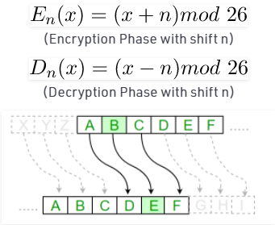

<h1>Caesar Cipher in Cryptography</h1>

A Java program to illustrate Caesar Cipher Technique 

Program that receives a Text (string) and Shift value( integer) and returns the encrypted text.

* The Caesar Cipher technique is one of the earliest and simplest method of encryption technique. 
 * It’s simply a type of substitution cipher, i.e., each letter of a given text is replaced by a letter some fixed number of positions down the alphabet

<h3>Algorithm for Caesar Cipher:</h3>
Input:
<ol>
  <li> A String of lower case letters, called Text.</li>
  <li> An Integer between 0-25 denoting the required shift.</li>
</ol>

Procedure:
<ol>
  <li> Traverse the given text one character at a time . </li>
  <li> For each character, transform the given character as per the rule, depending on whether we’re encrypting or decrypting the text. </li>
  <li> Return the new string generated. </li>
</ol>

<h3>Q- How to encrypt using Caesar cipher?</h3>

  Encryption with Caesar code is based on an alphabet shift (move of letters further in the alphabet), 
  it is a monoalphabetic substitution cipher, ie. a same letter is replaced with only one other (always the same for given cipher message). 
  The most commonly used shift/offset is by 3 letters.
<table style="width:100%">
  <tr>
    <th>Plain Alphabet</th>
    <th>ABCDEFGHIJKLMNOPQRSTUVWXYZ</th>
    
  </tr>
  <tr>
    <th>Caesar Alphabet (+3)</th>
    <th>DEFGHIJKLMNOPQRSTUVWXYZABC</th>
    
  </tr>
  
</table>

	

